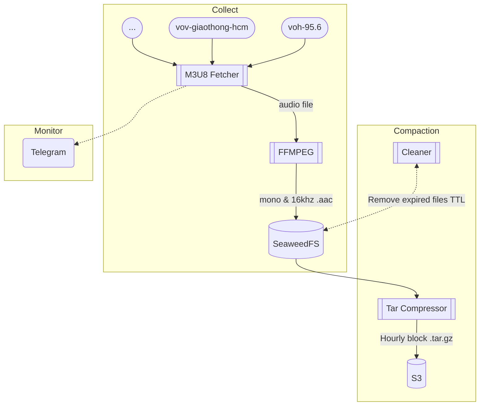

# Grokking Fundamental AI Lab

## List of projects

1. Traffic Congestion Detection
2. ...

## Design Diagram
### Radio Data Collector

---

I do not know what I may appear to the world, but to myself I seem to have been only like a boy playing on the seashore, and diverting myself in now and then finding a smoother pebble or a prettier shell than ordinary, whilst the great ocean of truth lay all undiscovered before me.

Isaac Newton
